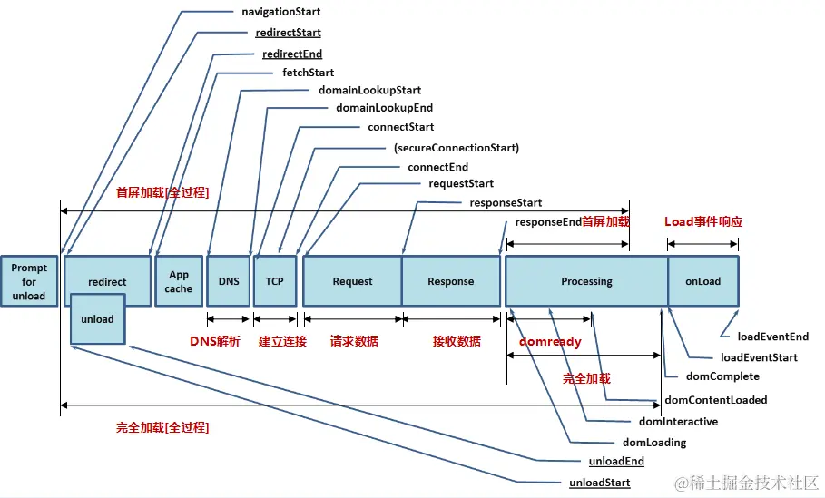
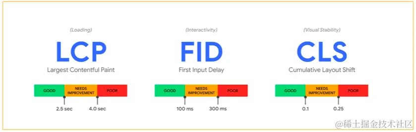

```javascript
const timing = performance.timing;

// DNS 解析耗时
timing.domainLookupEnd - timing.domainLookupStart;

// TCP 连接耗时
timing.connectEnd - timing.connectStart;

// SSL 安全连接耗时
timing.connectEnd - timing.secureConnectionStart;

// 网络请求耗时
timing.responseStart - timing.requestStart;

// 数据传输耗时
timing.responseEnd - timing.responseStart;

// DOM 解析耗时
timing.domInteractive - timing.responseEnd;

// 资源加载耗时
timing.loadEventStart - timing.domContentLoadedEventEnd;

/* 关键性能指标 */

// 首包时间
timing.responseStart - timing.domainLookupStart;

// 白屏时间
timing.responseStart - timing.navigationStart;

// 首次可交互时间
timing.domInteractive - timing.requestStart;

// HTML 加载完成时间， 即 DOM Ready 时间
timing.domContentLoadedEventEnd - timing.navigationStart;

// 页面完全加载时间
timing.loadEventStart - timing.navigationStart;
```


#### Google Web Vitals - 使用者体验量化

> 谷歌认为之前的标准太复杂，指标太多了。Google 于 2020 年 5 年 5 日提出了新的使用者体验量化方式，推出 Web Vitals 是简化这个学习的曲线，大家只要观注 Web Vitals 指标表现即可。加载性能LCP，交互性FID，视觉稳定性CLS。只需要做好这三个，网站的性能基本上就可以了。

- LCP（Largest Contentful Paint ）最大内容绘制时间，主要内容对用户的可见时间。img图片，video元素的封面，通过url加载到的背景，文本节点等
- FID （first Input Delay）首次输入延时，用户可在网页输入文字、点击按钮的时间
- CLS （Cumulative Layout Shift）累计版面布局位移 (衡量网页元件视觉稳定性)



测量Web Vitals的工具有很多，比如Lighthouse，web-vitals，浏览器插件web vitals


## 上报逻辑

- ajax、fetch上报，通过Ajax的方式往后台发送监控数据
- image上报，使用一个 1像素的图片实现数据上报
- jsonp上报，和image上报类似，支持跨域
- sendBeacon  不占用网络请求资源，通常尝试在卸载（unload）文档之前向 Web 服务器发送数据

推荐使用最后一种方案`navigator.sendBeacon()`, 可用于通过 HTTP POST 将少量数据 异步 传输到 Web 服务器

```js
js
复制代码navigator.sendBeacon(url);
navigator.sendBeacon(url, data);
// 页面隐藏时，上报数据
document.addEventListener("visibilitychange", function logData() {
  if (document.visibilityState === "hidden") {
    navigator.sendBeacon("/log", analyticsData);
  }
});
```

> 当用户代理成功把数据加入传输队列时，sendBeacon() 方法将会返回 true，否则返回 false

使用 sendBeacon() 方法会使用户代理在有机会时异步地向服务器发送数据，同时不会延迟页面的卸载或影响下一导航的载入性能，这意味着：

- 数据发送是可靠的。
- 数据异步传输。
- 不影响下一导航的载入
